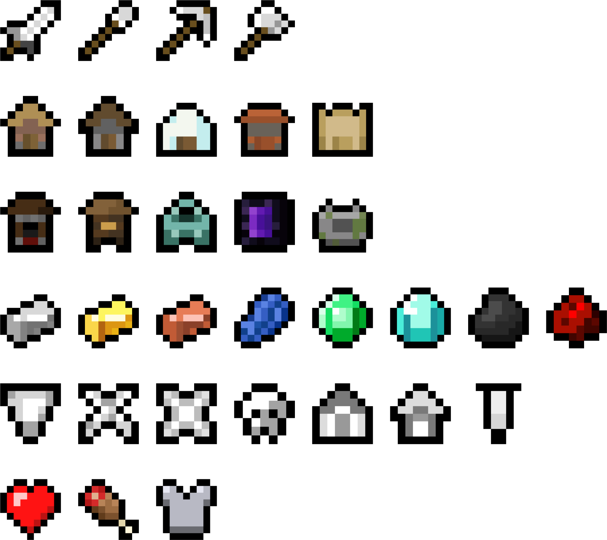

# More JourneyMap Icons

This is a resource pack that contains additional icons to use as JourneyMap waypoints, also replacing the default icons to keep the icon resolution consistent.

This pack uses Vanilla map icons as a base, but with some additional icons added and some modifications made to the existing icons.

Set the waypoint color to white in order to use colorful icons without tinting them.

## Icons

## Installation

1. Download the latest release from the [releases page](https://github.com/yourusername/MoreJourneyMapIcons/releases) or [Modrinth](https://modrinth.com/mod/more-journeymap-icons).
2. Place the zip file in your Minecraft instance's 'resourcepacks' folder.
3. If the game is already running, restart it to update waypoints to use the new icons.
