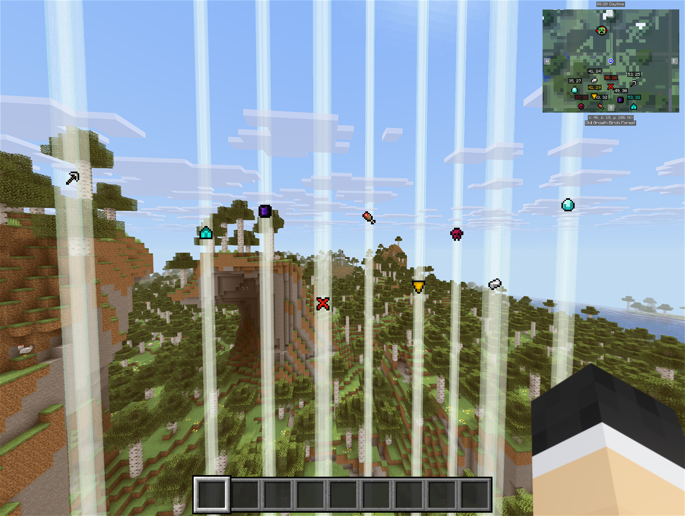
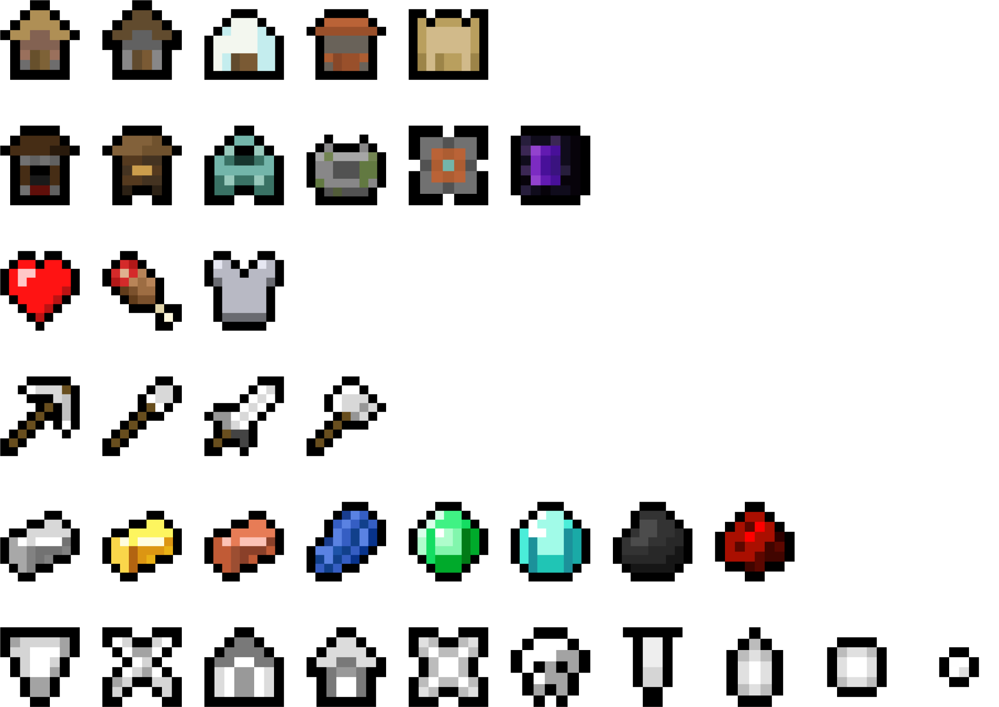

  
  <!-- -->
  

  <h3>More JourneyMap Icons</h3>
  
  <h6>by <a href="https://modrinth.com/user/nickesc">nickesc</a></h6>
  
<i>An addon resource pack for JourneyMap with more icons to use as waypoints.</i>

---

### Overview

*More JourneyMap Icons* is an addon resource pack for [JourneyMap](https://modrinth.com/mod/journeymap) that contains additional icons to use as waypoints, while also replacing the default icons to keep the style and resolution consistent.

This pack uses Vanilla map icons as a base, but with some additional icons added and some modifications made to the existing icons.

Set the waypoint color to white in order to use colorful icons without tinting them.

### Icons

The following icons are available for use in the pack:

### Installation

1. Download the latest release from the [releases page](https://github.com/nickesc/More-JourneyMap-Waypoints/releases) or [Modrinth](https://modrinth.com/project/more-journeymap-waypoints).
2. Place the zip file in your Minecraft instance's `resourcepacks` folder.
3. If the game is already running, restart it to update waypoints to use the new icons.

### License

This project is licensed under the MIT License - see the [LICENSE](LICENSE) file for more details.
